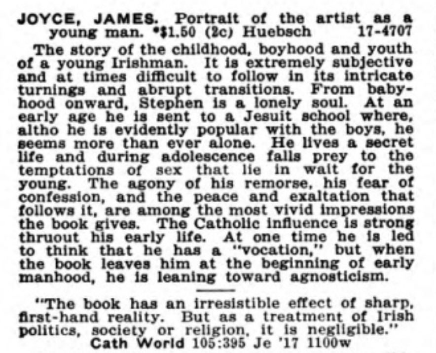
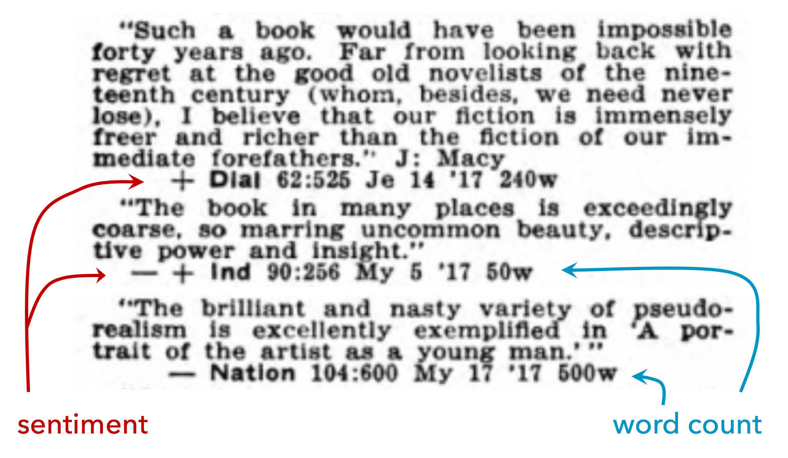

*Session 264 on "Databases and Print Culture Studies" was organized by Lise Jaillant, and presided over by Carol DeBoer-Langworthy. The other presenters were Katherine Bode and Anthony Glinoer; Richard So couldn't attend. This is the text of "No Such Thing as Bad Publicity: Toward a Distant Reading of Reception," delivered by Ted Underwood. Fri, Jan 10, 2020.*

Book historians and distant readers share a willingness to grapple with large datasets, and one premise of this panel is that the two groups of scholars can learn a lot from each other.

But of course we can learn from each other because we have different approaches. In fact, until the last few years, we were talking about basically different things. Distant readers have tended to begin by collecting one copy of every title we could get, dated by first publication. But, as Katherine Bode has rightly pointed out, a collection dated by first publication won't tell you much about reading. A book like Little Women is still being reprinted and read today.

For that matter, even if we're interested in the year 1868, one copy of each title isn't a great way to represent reception. *Little Women* may have been more important than other books—or important in a different way—even at the time. For that reason, James English has stressed that a full picture of literary culture needs to talk about valuation.

All of that is true. The collections distant readers built ten or twenty years ago informed us about literary production, not circulation or reception. I think they did that very well, and taught us a lot about literary production in the last twenty years. But if we want to learn about the other half of a book's life cycle, we're going to need other kinds of evidence.

That's what I'll discuss today. I'm building a collection of book reviews--journalistic responses to fiction--that will eventually stretch from about the middle of the nineteenth century to the early twenty-first. Now, reviews obviously won't tell us who bought a book or how often they read it. Reviews can only inform us about the *public* part of reception. And perhaps we assume that the public part is already well understood—after all, the evidence is public! But I've been convinced by the last twenty years of research that being able to read things one by one doesn't necessarily mean we understand them as a system.

For instance, what kind of influence do reviews actually have on literary history? Literary historians paint a picture with causal arrows pointing in different directions. Sometimes a new style is said to overcome sluggish critical resistance, but sometimes the story works the other way around, and influential critical statements are said to crystallize a new literary movement or genre. How much truth is there in either story? And if reviews do have a shaping influence on literary history, can we say which publications were most influential? Were avant-garde little magazines actually in the vanguard?

I'm not going to answer those questions today. But I think they are questions that genuinely lack answers, and ones we *could* answer by pairing literary texts with large-scale evidence about reception. There was a test run for this in [one chapter of my last book,](https://www.press.uchicago.edu/ucp/books/book/chicago/D/bo35853783.html) which used a sample of book reviews to construct a model of literary prestige and then asked how quickly prestige changed over time. But our sample of reviews was smallish and frankly arbitrary. I just asked friends which magazines they considered important. A bigger and less arbitrary sample of reviews could provide a better foundation.

So, how do we get bigger and less arbitrary? If you've been reading polemics by or about distant readers, you might imagine that we would try to get every book review ever published. But of course that's not possible, and no one really thinks it is.

Maybe our job is instead to create a truly representative sample of publications, by selecting the magazines and newspapers that were most important—or by selecting a group correctly balanced to represent the breadth and range of literary culture. And to be sure, we could try. But I'm not confident we actually know which magazines were important; that's one of the questions I want to pose. And there are probably different valid ways of defining the cultural breadth and range we're trying to represent.

So my take on this is: we might as well start by acknowledging that the past can be seen from many different angles, and our task as historians is not to construct an unbiased source,—but to understand each source, as Ben Schmidt has put it, "through its biases." This may be especially true in the humanities, but even climate scientists grapple with similar problems. How do we reconstruct the history of climate? Scientists can't sample weather stations evenly distributed across the globe and across the last ten million years, because the past—rather awkwardly—doesn't exist. What we have instead are traces. Tree rings from one place and time—and ice cores that preserve evidence of a different, partly overlapping period—and so on. Each source tells a different story, but by comparing them we can ask why they diverge and where they overlap.

Similarly with book reviews, we're going to have many different collections, created at different times and for different reasons. Right now several groups of scholars (at Illinois and elsewhere) are trying to turn those collections into machine-readable structured data. We know that each picture will be incomplete, but our goal is to produce multiple overlapping pictures. I won't try to describe the whole enterprise, because it isn't mine to describe; it's a loose coalition of independent projects. 

I'll talk just about what we're doing at Illinois, and actually just one part of what we're doing—which is gathering data from one of the great print indexes produced for twentieth-century reference libraries—the Book Review Digest of H. W. Wilson & Co.

In your home library, somewhere, there is a ten foot wide, floor-to-ceiling section of shelving devoted to this digest. It was first published in 1905, by the same company that prints the Reader's Guide to Periodical Literature. But where the Reader's Guide only provides metadata, the Book Review Digest provides excerpts of reviews and aims to make it possible for you to decide whether to buy a book by browsing the excerpts. This is what it looks like. 

As you can see, there's an initial note describing the book, followed by judgments from various publications. Catholic World complains that Joyce gives a misleading picture of Ireland. 

One the other hand, the Dial quite likes the book, the Independent is mixed, and the Nation quite negative ("nasty ... pseudo-realism"). If you don't have time to read the excerpts, many reviews are accompanied by a symbol that summarizes the sentiment. There are four levels: plus is good, minus is bad, and in the middle, plus-minus is better than minus-plus. Notice also (this is going to be important) that each of these entries reports the length of the the original review.

The BRD doesn't of course include all book reviews. It indexes a particular set of about fifty publications: mostly US, some British, mostly for a general audience, but some scholarly journals or literary magazines. The specific publications keep changing across the history of the digest. So not all books will be covered—just books that were reviewed in those publications. In short, there is nothing universal about the BRD; it's a perspective from a particular vantage point in North America.

On the other hand, it's a perspective that has the advantage of being contemporary to the culture described, unlike any list we would construct in 2020. It also has the advantage of being a durable institution: the Digest starts in 1905 and continues to the present, covering for much of that period roughly a thousand works of fiction a year. That's not everything, by any means. But it's a big slice of the part of the fiction market that got journalistic attention. And remember, we are ultimately going to combine this with other sources: indexes to little magazines, Publishers Weekly, Kirkus Reviews.

Digital copies of the BRD are held at HathiTrust Digital Library. I'm working in collaboration with a doctoral student, Wenyi Shang, to extract structured data from them. When we're done— I hope next summer—we will share that data. Because much of the print run is in copyright, we can't share the whole text as it stands. But factual metadata can't be copyrighted, so we can report for instance that the Dial spent 240 words on this book and The Nation 500. Also we can export term frequency counts for the reviews—and if we're clever, there's actually a lot one can learn from term frequencies.

Turning this into structured data hasn't been easy. You need to decide when metadata stops and when a review starts, which is complicated by OCR errors (quotation marks, for instance, may not be preserved in OCR). I've been working on the code to parse the text for about two years, and only about a month ago started to get good data out. So far we're only up to 1930.

We have not had this data long enough to tackle any of the big questions about influence and change I described earlier. But even simple descriptive statistics can tell some interesting stories. For instance, one simple thing we've discovered is that the central premise of the Digest may be misguided. That is, it may be wrong to imply that positive or negative reviews will tell you which works of fiction are important enough for a library to acquire. In the nineteen-teens and twenties, at any rate, we find very little evidence that the verdicts passed by reviewers correlate at all with the prominence or prestige of a book. Prominent and prize-winning books do not actually get better reviews.

If you average all the reviews for a book—treating a plus as a 4, a plus-minus as a 3, and so on—you can produce an average sentiment figure for each book. Then we can compare average review sentiment for different groups of books: bestsellers, books by Pulitzer-prize winning authors, books published by different publishers, and so on. But, as you can see, there's no significant difference between the median sentiment of the reviews for these different groups of books. Some of the publishers appear to have more extremely low outliers, but that's partly because there are just more books in those groups than in the bestsellers or prizewinners. The center of distribution is really no different.

That should I think be a little surprising. We often talk as if reviewers' judgments had the power to make a book important or let it sink into obscurity. But there is little evidence in this data that reviewers' sentiments make the difference between the prizewinners (or bestsellers) and the rest of the crowd.

There is on the other hand very strong evidence that successful books get more reviews and longer reviews. When we add up those wordcount figures for all of a books' reviews, and plot the total number of words spent on a book, the bestsellers and Pulitzer-winning authors are leading the pack, getting four to five times as much attention as the average say Bobbs-Merrill author. I can't say which of these things is causing the other—even to speculate we would have to look in more detail at the dates of reviews—but it's certainly a correlation.

I guess this evidence points to a familiar lesson. People often say "there's no such thing as bad publicity," and if you believe that, you would expect the sheer amount of coverage a book gets to matter more than positive or negative spin. On the other hand, I bet people in this room who have written books can remember that it was hard to trust that maxim in your heart at the moment you got a bad review. So perhaps it will be useful to have hard evidence that the maxim is true. At least in the US, in the 1920s, and at the high end of the market, bad reviews don't seem to have hurt. If anything, they helped, by increasing the total amount of oxygen in the room.

But this is just a first pass at the problem. There are many other things we could try. For instance, I've only tested high-end contrast: average books versus bestsellers or Pulitzer authors. Maybe bad reviews do start to hurt further down the pecking order—if, say, the bad review is the only one you get? We could also ask about the trajectory of an author's career over time. Maybe a bad review doesn't hurt book #3, but does reduce reviewers' interest in book #4?

But I wasn't really trying to make an argument about literary history today. We've only had this data for a month, and nothing I've said does more than scratch the surface of it. I haven't talked about book prices for instance. Heck, I haven't talked about the texts of the reviews themselves! There has been no text analysis in this talk and no statistical modeling. I'm just describing data we're going to have, and gesturing to the future. I think the boundary between approaches will soon get blurry, as we collectively start combining the methods of distant readers with book historians' attention to what Robert Darnton called the "communications circuit"—the full life cycle of a book.

